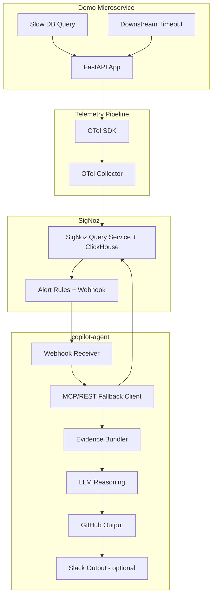
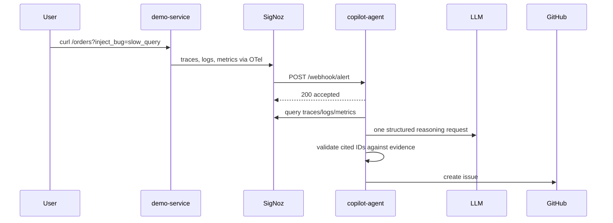

# RootCauser Architecture

## High-Level Architecture

## Incident Sequence

## ADR Summary

**ADR-01: Modular Monolith Agent**  
`copilot-agent` is one deployable FastAPI service split into modules, not multiple microservices.

**ADR-02: Single LLM Call**  
Each incident uses one structured LLM request. Evidence retrieval and confidence scoring stay deterministic Python logic.

**ADR-03: Rule-Based Confidence**  
Confidence is computed from verified citation types. Span plus metric gives High; one signal gives Medium; weak accepted evidence gives Low.

**ADR-04: MCP First, REST Fallback**  
The local SigNoz deployment did not expose a usable MCP endpoint, so `mcp_client.py` uses a REST fallback while preserving the same public function signatures.

**ADR-05: No Database in MVP**  
The agent is stateless. Local Markdown issue artifacts are written only as a demo fallback, not as durable application storage.

## Non-Negotiable Guardrail

Every LLM-produced citation must be verified against the evidence bundle. If any cited trace ID, span ID, or metric name is absent, the hypothesis is rejected and returned as `Insufficient Evidence`.
## Evidence retrieval and grounding

The agent uses SigNoz REST `POST /api/v5/query_range` for raw traces/logs and time-series metrics. A production alert rule UUID is resolved with `GET /api/v2/rules/{uuid}` (not the old numeric v1 route). Rule metrics, composite query, threshold, and alert name guide deterministic evidence ranking. Health/readiness/liveness spans are deprioritized; matching operation names, service, errors, duration, and trace/log correlation are prioritized. OpenRouter is the reasoning provider, configured by `LLM_MODEL_NAME`; strict citation validation gates GitHub Issue and Slack delivery.
