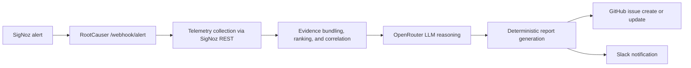

# RootCauser

RootCauser is a working engineering prototype for automated incident investigation. It receives SigNoz alerts, gathers incident telemetry, deterministically selects relevant evidence, asks an LLM for a grounded hypothesis, validates its citations, and publishes the result to GitHub and Slack.

## Problem

Investigating an alert often requires manual correlation of traces, logs, metrics, and alert-rule context. RootCauser automates the first investigation pass while keeping evidence selection and claim validation deterministic.

## Architecture



This map matches the current code path:

- `copilot-agent/main.py` receives the webhook, extracts alert context, fetches SigNoz rule details, and orchestrates the run.
- `copilot-agent/mcp_client.py` retrieves traces, logs, metrics, and alert details from SigNoz REST.
- `copilot-agent/evidence_bundler.py` normalizes, ranks, and correlates the raw telemetry into an `EvidenceBundle`.
- `copilot-agent/reasoning.py` asks OpenRouter for a grounded hypothesis and validates citations.
- `copilot-agent/github_output.py` renders the deterministic report and creates or updates the GitHub issue with incident versioning.
- `copilot-agent/slack_output.py` sends the summary notification when configured.

## Workflow

```text
SigNoz alert → FastAPI webhook → SigNoz evidence retrieval → deterministic ranking
→ OpenRouter reasoning → citation validation → GitHub incident issue → Slack notification
```

1. SigNoz calls `POST /webhook/alert`.
2. The agent extracts the affected service, incident window, and, when present, the alert-rule UUID from `alerts[0].labels.ruleId` so it can fetch the full SigNoz rule details.
3. It retrieves traces, logs, and metrics through SigNoz REST.
4. It ranks evidence before LLM use, using alert semantics, service, correlation, time proximity, errors, duration, health penalties, and diversity controls.
5. OpenRouter receives only the selected evidence bundle. Every cited ID must be present in that bundle.
6. A validated result is rendered as a GitHub issue and summarized through Slack when configured.

For a stable incident fingerprint, RootCauser combines the service, alert name, and normalized labels to decide whether two firings belong to the same open incident. The first active firing creates Incident Version 1 and repeated firings update the same GitHub issue with incremented versions. A reliable `RESOLVED` status marks that in-memory incident as resolved so the next firing starts a new Version 1 issue.

If telemetry is missing, a log query fails, or the LLM cannot support a claim, RootCauser reports insufficient evidence rather than inventing a root cause.

## Technologies

- Python, FastAPI, Pydantic, Requests
- OpenTelemetry and OpenTelemetry Collector
- SigNoz REST APIs: `POST /api/v5/query_range`, `GET /api/v2/rules/{uuid}`
- OpenRouter OpenAI-compatible chat completions API
- GitHub Issues and Slack Incoming Webhooks
- Docker Compose, pytest, Ruff

## Run locally

```powershell
docker compose up -d --build
Invoke-RestMethod http://localhost:8000/health
Invoke-RestMethod http://localhost:8001/health
```

Generate slow-query telemetry:

```powershell
Invoke-RestMethod "http://localhost:8000/orders?inject_bug=slow_query"
```

Run deterministic tests:

```powershell
venv\Scripts\python.exe -m pytest -q
```

See [Setup and Testing](docs/SETUP_AND_TESTING.md) for manual-webhook and real alert end-to-end verification.

## Current status

RootCauser is a working prototype suitable for demonstrating engineering decisions around telemetry normalization, deterministic evidence ranking, grounded LLM reasoning, and automated incident reporting. It is not presented as production-ready: local SigNoz behavior and external GitHub, Slack, and OpenRouter credentials remain runtime dependencies.
