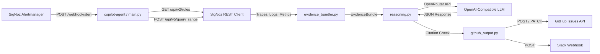
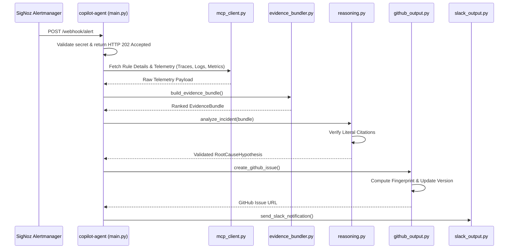

# RootCauser

RootCauser is a local-first engineering prototype for automated incident investigation. It intercepts SigNoz alert webhooks, queries observability telemetry from SigNoz REST endpoints, deterministically selects and ranks relevant evidence, requests a grounded root-cause hypothesis from an LLM, verifies literal evidence citations, and publishes version-tracked incident reports to GitHub and Slack.

---

## Problem & Motivation

When an alert fires in a distributed system, on-call engineers spend critical time manually correlating trace spans, log error messages, metric spikes, and alert rule thresholds. Traditional manual triage introduces significant **Mean Time to Detect/Diagnose (MTTD)** latency.

Existing automated solutions often attempt to dump raw telemetry directly into an LLM context window. This approach suffers from context window overflow, high inference costs, unpredictable output formatting, and severe risk of **LLM hallucinations** (inventing fictitious trace IDs or root causes).

RootCauser addresses this by enforcing a strict separation of concerns:
1. **Deterministic Retrieval & Scoring:** Telemetry collection and evidence ranking are performed 100% deterministically in Python using explicit mathematical scoring heuristics.
2. **Grounded LLM Synthesis:** The LLM is restricted to analyzing a bounded evidence bundle and must literally cite verified telemetry IDs.
3. **Citation Guardrails:** Any hypothesis citing a `trace_id`, `span_id`, or metric not present in the input bundle is automatically rejected.

---

## Key Features

* **SigNoz Alert Webhook Receiver:** Accepts SigNoz alert POST payloads (`/webhook/alert`), extracts service identity and time windows, and resolves alert rule metadata via SigNoz v2 rules endpoints.
* **Deterministic Evidence Bundler:** Normalizes raw trace, log, and metric records. Ranks evidence using service match, alert semantics, log-to-trace ID correlation, error flags, temporal proximity, and health check penalties.
* **Grounded LLM Reasoning & Citation Validation:** Interfaces with OpenRouter (`gpt-4o-mini`). Programmatically rejects unverified citations to prevent hallucinated incident reports.
* **Active Incident Versioning:** SHA-256 fingerprinting over `(service, alert_name, labels)`. Repeated firings during an active outage update the existing GitHub issue and increment `Incident Version`. Explicit `RESOLVED` payloads reset fingerprint state.
* **Resilient Telemetry Ingestion:** Handles raw ClickHouse/SigNoz data structures; falls back cleanly if log querying is unavailable without interrupting trace/metric triage.
* **Slack Integration:** Sends summary notifications with direct links to the created or updated GitHub issue.

---

## Architecture Overview



### End-to-End Sequence Flow



---

## Technology Stack

* **Language & Web Framework:** Python 3.11+, FastAPI, Uvicorn, Pydantic v2, Requests.
* **Observability Platform:** SigNoz (v5 `query_range` & v2 `rules` REST APIs), OpenTelemetry SDK, OpenTelemetry Collector.
* **LLM Integration:** OpenRouter Chat Completions API (`gpt-4o-mini` with JSON mode).
* **Output Systems:** GitHub Issues REST API v3, Slack Incoming Webhooks.
* **Infrastructure & Tooling:** Docker Compose, pytest, Ruff linting/formatting.

---

## Project Structure

```text
RootCauser/
├── README.md                        # Project overview & quickstart (this file)
├── ARCHITECTURE.md                  # Detailed architectural & scoring reference
├── docker-compose.yml              # Complete SigNoz + Collector + Demo + Agent stack
├── Makefile                         # Helper commands (make up, make down, make test)
├── copilot-agent/                   # Incident investigation copilot agent
│   ├── config.py                    # Environment settings via Pydantic BaseSettings
│   ├── evidence_bundler.py          # Deterministic evidence scoring & bundling engine
│   ├── github_output.py             # Markdown generator & in-memory incident state
│   ├── main.py                      # FastAPI app entry point & webhook orchestrator
│   ├── mcp_client.py                # SigNoz REST v5/v2 API client
│   ├── prompts/                     # System, investigation, reasoning & report templates
│   ├── reasoning.py                 # LLM interface & citation validation logic
│   └── slack_output.py              # Slack incoming webhook dispatcher
├── demo-service/                    # Target e-commerce microservice with bug injection
│   ├── app.py                       # FastAPI application (/orders, /checkout, /health)
│   ├── otel_config.py               # OpenTelemetry SDK providers setup
│   └── bugs/                        # Failure scenario simulators
│       ├── slow_query.py            # Simulated 2s DB query & latency metrics
│       └── flaky_downstream.py      # Simulated downstream payment API timeout
├── docs/                            # Deep-dive documentation and test scripts
│   ├── IMPLEMENTATION_GUIDE.md      # Detailed runtime flow & module breakdown
│   ├── SETUP_AND_TESTING.md         # Local deployment and manual verification guide
│   ├── alert_rules.md               # SigNoz alert configuration specifications
│   ├── demo_script.md               # Live demonstration walkthrough script
│   ├── failure_scenarios.md         # Supported vs. roadmap failure scenarios
│   └── mcp_investigation_notes.md   # SigNoz REST API integration notes
└── tests/                           # Deterministic offline unit test suite (43 tests)
```

---

## Setup and Run Instructions

### Prerequisites
* Docker Engine 20.10+ and Docker Compose v2.
* Python 3.11+ (for local pytest and development).
* Valid OpenRouter API Key (`LLM_API_KEY`) and GitHub Token (`GITHUB_TOKEN`).

### 1. Environment Configuration
Copy `.env.example` to `.env` and fill in your credentials:

```bash
cp .env.example .env
```

Key environment variables:
* `LLM_API_KEY`: OpenRouter API key for LLM reasoning.
* `LLM_MODEL_NAME`: Target model (default: `gpt-4o-mini`).
* `GITHUB_TOKEN`: GitHub Personal Access Token with repository write permissions.
* `GITHUB_REPO`: Target repository in `owner/repo` format.
* `SLACK_WEBHOOK_URL`: Optional Slack incoming webhook URL.
* `WEBHOOK_SHARED_SECRET`: Optional shared secret for verifying incoming webhooks.

### 2. Start the Stack
Bring up SigNoz, OpenTelemetry Collector, Demo Service, and Copilot Agent using Docker Compose:

```bash
docker compose up -d --build
```

Verify service health endpoints:

```powershell
Invoke-RestMethod http://localhost:8000/health
Invoke-RestMethod http://localhost:8001/health
```

Exposed Services:
* **SigNoz UI / API:** `http://localhost:8080`
* **Demo Service API:** `http://localhost:8000`
* **Copilot Agent Webhook:** `http://localhost:8001`
* **OTLP gRPC Collector:** `localhost:4317`

---

## Triggering Supported Failure Scenarios

RootCauser includes two seeded failure scenarios inside `demo-service` to test telemetry correlation and incident investigation end-to-end.

### Scenario 1: Slow Database Query (`slow_query`)
Injects a 2-second database delay, emitting a `db.orders.slow_query` span, a warning log, and recording latency in the `db.query.duration` histogram.

```powershell
# Generate slow query telemetry
Invoke-RestMethod "http://localhost:8000/orders?inject_bug=slow_query"
```

### Scenario 2: Downstream Payment API Timeout (`flaky_downstream`)
Simulates a 1.5-second external payment API timeout, emitting an error span `downstream.payment_api.call`, an error log, and incrementing the `downstream.errors` counter metric.

```powershell
# Generate downstream timeout telemetry
Invoke-RestMethod "http://localhost:8000/orders?inject_bug=flaky_downstream"
```

---

## Sample Investigation Output

When an alert fires, RootCauser renders a structured GitHub issue markdown report combining deterministic telemetry facts with citation-verified LLM hypotheses:

```markdown
# [RootCauser] demo-service: High root-cause hypothesis

### Incident Overview
- **Service:** demo-service
- **Alert Name:** High DB Query Latency
- **Incident Version:** 1
- **Confidence:** High
- **Cited Telemetry IDs:** `083a45f91e2b`, `db.query.duration`

### Evidence Summary
| Evidence | Observation | Relevance |
| --- | --- | --- |
| Traces | 3 selected spans (`db.orders.slow_query`); duration 2001–2003 ms | High |
| Logs | 1 selected log with severity WARN | High |
| Metrics | `db.query.duration` 15.2 → 2001.4 | High |
| Correlation | 1 log matched selected trace/span IDs | High |

### Root Cause Hypothesis
Query execution on the orders table exceeded the 1500ms threshold due to an unindexed query during peak list processing.

### Suggested Remediation
Investigate database index configuration for `status = 'processing'`; consider query optimizations before adjusting timeout thresholds.

<details>
<summary>Raw Telemetry Bundle (JSON)</summary>

```json
{
  "spans": [ ... ],
  "logs": [ ... ],
  "metrics": [ ... ]
}
```
</details>
```

---

## Testing & Quality Control

RootCauser includes a comprehensive, offline test suite (43 unit/integration tests) that runs without external network dependencies:

```powershell
# Run unit test suite
venv\Scripts\python.exe -m pytest -v

# Run code style & lint checks
venv\Scripts\python.exe -m ruff check copilot-agent tests
```

Continuous Integration runs automatically via GitHub Actions ([`.github/workflows/ci.yml`](file:///.github/workflows/ci.yml)), executing linting, formatting checks, unit tests, container builds, and secret scanning.

---

## Current Limitations

1. **In-Memory Incident State:** Active incident state maps (`_ACTIVE_INCIDENTS`) are stored in container process memory. Restarting the agent container resets version counters to 1.
2. **Single-Service Scope:** Triage queries telemetry strictly for the primary `service_name` reported in the alert payload. Cascading microservice failures require alerts on peer services to correlate telemetry.
3. **Synchronous Query Execution:** Telemetry queries (`traces`, `logs`, `metrics`) are fetched sequentially via standard HTTP requests.

---

## Future Roadmap

- [ ] **Distributed Incident Persistence:** Replace process-local memory state with a Redis/Postgres datastore for multi-replica deployments.
- [ ] **Durable Task Queue:** Integrate Celery or ARQ for asynchronous webhook queueing during alert storms.
- [ ] **Multi-Service Topology Traversal:** Automatically traverse OpenTelemetry dependency graphs to query upstream/downstream peer services.
- [ ] **Async HTTP Client:** Convert `mcp_client.py` to `httpx` with `asyncio.gather()` for parallel telemetry queries.
