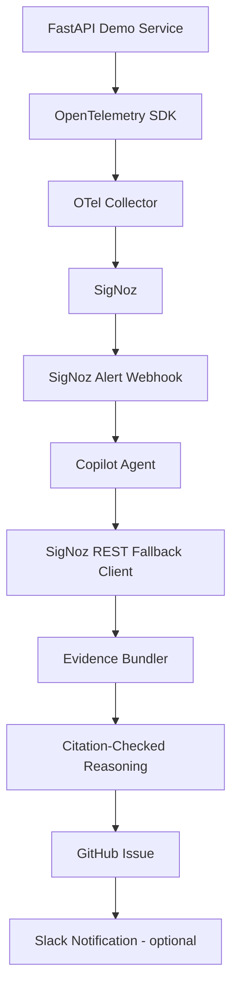

# RootCauser

RootCauser is a locally runnable autonomous SRE copilot demo: a seeded FastAPI service emits OpenTelemetry into SigNoz, SigNoz alerts on two known failure modes, and a copilot agent gathers traces, logs, and metrics to produce a citation-checked root-cause hypothesis and GitHub Issue.

## Problem

Incident response often starts with noisy alerts and manual dashboard hopping. Engineers need to correlate traces, logs, metrics, and alert metadata before they can even form a first hypothesis.

## Solution

RootCauser closes that loop for a focused MVP: alert fires, evidence is retrieved from SigNoz, an LLM reasons over a deterministic evidence bundle, citations are verified in Python, and a GitHub Issue is created with the result.



## How It Works

1. The demo service exposes `/orders` and `/checkout`.
2. `?inject_bug=slow_query` creates a slow manual span, warning log, and DB latency metric.
3. `?inject_bug=flaky_downstream` creates an errored downstream span, error log, and error metric.
4. SigNoz alert rules detect the latency or error signal and call `copilot-agent`.
5. The agent queries SigNoz for evidence, ranks the top spans/logs/metrics, and calls the LLM once.
6. Every LLM citation must literally exist in the evidence bundle or the result becomes `Insufficient Evidence`.
7. The final report is written locally and, when configured, filed as a GitHub Issue. Slack is optional.

## Quickstart

```bash
git clone <your-repo-url>
cd rootcauser
cp .env.example .env
```

Edit `.env` for the full autonomous loop:

```bash
LLM_API_KEY=...
LLM_MODEL_NAME=gpt-4o-mini
GITHUB_TOKEN=...
GITHUB_REPO=owner/repo
```

Start the local stack:

```bash
make up
```

Useful URLs:

- SigNoz UI/API: `http://localhost:8080`
- Demo service: `http://localhost:8000`
- Copilot agent: `http://localhost:8001`

Trigger baseline and seeded incidents:

```bash
curl http://localhost:8000/health
curl http://localhost:8000/orders
curl "http://localhost:8000/orders?inject_bug=slow_query"
curl "http://localhost:8000/orders?inject_bug=flaky_downstream"
```

Run local unit checks:

```bash
python -m pip install -r copilot-agent/requirements.txt pytest
pytest tests/
```

Manual SigNoz/LLM smoke tests after telemetry exists:

```bash
python copilot-agent/manual_test_mcp.py
python copilot-agent/manual_test_reasoning.py
```

Stop the stack:

```bash
make down
```

## Why SigNoz

SigNoz provides the local observability backend, alerting engine, and correlated traces/logs/metrics needed for the demo. The current self-hosted setup did not expose a usable MCP endpoint, so RootCauser implements the locked ADR-04 fallback: a same-shaped client over SigNoz HTTP APIs, documented in `docs/mcp_investigation_notes.md`.

## Tech Stack

- Python 3.11
- FastAPI
- Docker Compose
- OpenTelemetry SDK and Collector
- SigNoz self-hosted
- OpenRouter chat completions at `https://openrouter.ai/api/v1/chat/completions`, using `LLM_MODEL_NAME`
- GitHub REST API
- pytest and Ruff

## Roadmap

- 1 week: harden SigNoz query shapes, add richer alert payload parsing, rehearse both demo scenarios repeatedly.
- 1 month: support more incident types, add deduplication, improve issue updates instead of always creating new issues.
- 3 months: add service topology context, ownership routing, and richer remediation suggestions.
- 6 months: productionize authentication, persistence, multi-service incidents, and human approval workflows.
## Investigation data path

RootCauser retrieves telemetry from SigNoz REST `POST /api/v5/query_range` and, when a webhook supplies a rule UUID, retrieves rule context from `GET /api/v2/rules/{uuid}`. Alert IDs are UUIDs. It deterministically normalizes and ranks traces, logs, and metrics before sending only that evidence bundle to OpenRouter. The configured `LLM_MODEL_NAME` is used with `https://openrouter.ai/api/v1/chat/completions`; the LLM reasons over evidence but does not retrieve it. Citation validation rejects unsupported claims before GitHub and Slack outputs are produced.
