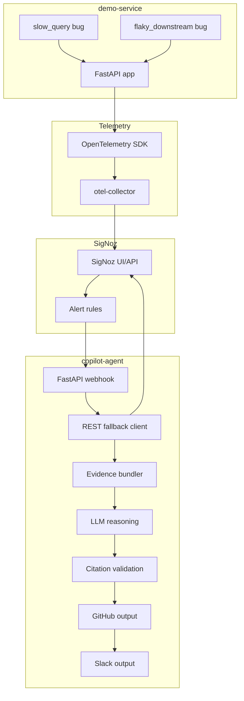

# Implementation Guide

This guide documents what exists in the current RootCauser repository and how to demo it safely.

## Project Overview

RootCauser is a local SRE copilot demo. A FastAPI demo service emits OpenTelemetry traces, logs, and metrics into SigNoz. SigNoz alert rules can notify a copilot agent. The agent retrieves evidence from SigNoz, builds a deterministic evidence bundle, asks an LLM for one structured root-cause hypothesis, validates every cited ID against the evidence bundle, writes a local issue artifact, creates a GitHub Issue when configured, and sends an optional Slack notification when configured.

## Problem Statement

Production incidents usually begin with an alert, but the first useful root-cause hypothesis requires manual correlation across traces, logs, metrics, and alert metadata. RootCauser demonstrates a constrained version of that workflow: gather the relevant observability evidence, reason over it once, and reject ungrounded answers.

## High-Level Architecture



## Component Interaction

1. `demo-service` receives normal or bug-injected API traffic.
2. `demo-service/otel_config.py` initializes OpenTelemetry providers.
3. `otel-collector` receives OTLP telemetry from the demo service.
4. SigNoz receives traces, logs, and metrics from the collector.
5. SigNoz alert rules, documented in `docs/alert_rules.md`, can call `copilot-agent`.
6. `copilot-agent/main.py` accepts `POST /webhook/alert` and immediately returns `{"status":"accepted"}`.
7. The background task queries SigNoz through `copilot-agent/mcp_client.py`.
8. `copilot-agent/evidence_bundler.py` ranks spans, logs, and metrics into a structured bundle.
9. `copilot-agent/reasoning.py` calls the LLM once, parses strict JSON, and validates cited IDs.
10. `copilot-agent/github_output.py` renders local Markdown and optionally creates a GitHub Issue.
11. `copilot-agent/slack_output.py` optionally sends a short Slack notification only after a GitHub Issue URL exists.

## Folder Structure

```text
rootcauser/
├── .github/workflows/
├── copilot-agent/
│   └── prompts/
├── demo-service/
│   └── bugs/
├── docs/
├── otel-collector/
├── signoz-config/
├── tests/
├── docker-compose.yml
├── Makefile
├── pyproject.toml
└── README.md
```

## Purpose of Every Major Folder

- `.github/workflows/`: GitHub Actions CI workflow for lint, format, tests, Docker builds, and secret scan.
- `copilot-agent/`: FastAPI alert receiver and investigation pipeline.
- `copilot-agent/prompts/`: Prompt files loaded by the reasoning layer. Prompts are intentionally not inline strings.
- `demo-service/`: FastAPI order/checkout service that emits telemetry.
- `demo-service/bugs/`: Two manually triggered seeded incident modules.
- `docs/`: Human-facing setup, testing, roadmap, alert, demo, and architecture documentation.
- `otel-collector/`: OpenTelemetry Collector configuration.
- `signoz-config/`: SigNoz/ClickHouse/collector configuration mounted into Docker containers.
- `tests/`: Unit tests for deterministic logic. These tests do not require live SigNoz, LLM, GitHub, or Slack.

## Purpose of Every Important File

- `.env.example`: Documents supported environment variables with placeholder values.
- `.gitignore`: Excludes local secrets, virtual environments, caches, and generated artifacts.
- `.github/workflows/ci.yml`: CI workflow.
- `ARCHITECTURE.md`: Condensed architecture diagrams and ADR summary.
- `Makefile`: Convenience commands for `make up`, `make down`, logs, and status.
- `README.md`: Project pitch, quickstart, and roadmap summary.
- `docker-compose.yml`: Local SigNoz stack, OTel collector, demo service, and copilot agent services.
- `pyproject.toml`: pytest and Ruff configuration.
- `demo-service/app.py`: FastAPI app with `/health`, `/orders`, and `/checkout`.
- `demo-service/otel_config.py`: OpenTelemetry setup for traces, metrics, and logs.
- `demo-service/bugs/slow_query.py`: Simulates a slow database query and records span/log/metric evidence.
- `demo-service/bugs/flaky_downstream.py`: Simulates a downstream payment API timeout and records error evidence.
- `demo-service/Dockerfile`: Container build for the demo service.
- `demo-service/requirements.txt`: Demo service Python dependencies.
- `otel-collector/otel-collector-config.yaml`: OTLP receiver and SigNoz exporter pipelines.
- `copilot-agent/main.py`: Agent health endpoint, alert webhook, and background investigation orchestration.
- `copilot-agent/config.py`: Pydantic settings loaded from environment and `.env`.
- `copilot-agent/mcp_client.py`: SigNoz evidence retrieval interface using the documented REST fallback.
- `copilot-agent/evidence_bundler.py`: Pure evidence ranking and structuring logic.
- `copilot-agent/reasoning.py`: LLM request, JSON parsing, citation verification, and confidence scoring.
- `copilot-agent/github_output.py`: GitHub Issue Markdown rendering, local artifact writing, and optional GitHub API creation.
- `copilot-agent/slack_output.py`: Optional Slack Incoming Webhook notification.
- `copilot-agent/manual_test_mcp.py`: Manual recent-window SigNoz retrieval smoke test.
- `copilot-agent/manual_test_reasoning.py`: Manual recent-window retrieval plus reasoning smoke test.
- `copilot-agent/Dockerfile`: Container build for the copilot agent.
- `copilot-agent/requirements.txt`: Agent Python dependencies.
- `copilot-agent/prompts/system_prompt.md`: System behavior and evidence-grounding rule.
- `copilot-agent/prompts/investigation_prompt.md`: Evidence bundle presentation prompt.
- `copilot-agent/prompts/reasoning_prompt.md`: Strict JSON output contract.
- `copilot-agent/prompts/issue_template.md`: Markdown issue template.
- `tests/test_evidence_bundler.py`: Unit tests for ranking, truncation, empty bundles, partial input, and metric anomaly handling.
- `tests/test_reasoning_parsing.py`: Unit tests for valid JSON, invalid citations, malformed JSON, and confidence scoring.
- `docs/alert_rules.md`: Reproducible alert-rule documentation.
- `docs/demo_script.md`: Short timed demo script.
- `docs/failure_scenarios.md`: Implemented and roadmap failure scenarios.
- `docs/mcp_investigation_notes.md`: Notes explaining why the REST fallback is used.
- `docs/SETUP_AND_TESTING.md`: Detailed setup and verification guide.
- `docs/FUTURE_ROADMAP.md`: Implemented MVP and future work.

## Complete Request Lifecycle

### Alert

SigNoz alert rules are documented in `docs/alert_rules.md`. The current repository does not automatically create those rules. In a live demo, SigNoz must be configured to send webhook notifications to:

```text
http://copilot-agent:8001/webhook/alert
```

### Webhook

`copilot-agent/main.py` exposes:

```text
POST /webhook/alert
```

It:

- Optionally checks `X-Rootcauser-Secret` when `WEBHOOK_SHARED_SECRET` is configured.
- Logs the raw payload.
- Enqueues `process_alert` as a FastAPI background task.
- Returns `{"status":"accepted"}` immediately.

### MCP

`copilot-agent/mcp_client.py` preserves the MCP-facing interface required by the project:

- `query_traces`
- `query_logs`
- `query_metrics`
- `get_alert_details`

The current implementation uses SigNoz REST APIs because the investigated local SigNoz deployment did not expose a usable MCP protocol endpoint.

### SigNoz

The client queries SigNoz for traces, logs, metrics, and optional alert-rule details. Each external SigNoz call retries once after a short fixed delay.

### Evidence

`build_evidence_bundle(traces, logs, metrics)` creates an `EvidenceBundle` containing:

- Top 5 slowest or error-flagged spans.
- Top 5 relevant log lines.
- Metric series with min, max, and anomaly point.

### Reasoning

`analyze_incident(bundle)`:

- Returns insufficient evidence immediately if the bundle is empty.
- Loads prompts from `copilot-agent/prompts/`.
- Calls an OpenAI-compatible chat completions endpoint once when `LLM_API_KEY` is configured.
- Retries the LLM call once on failure.
- Parses the response into `RootCauseHypothesis`.

### Citation Verification

`parse_and_validate_hypothesis(response_text, bundle)` rejects output when:

- JSON parsing fails.
- The model sets `insufficient_evidence` to `true`.
- Any cited ID is not a literal substring of the evidence bundle.

Accepted output receives deterministic confidence:

- `High`: cites both a span/trace and a metric.
- `Medium`: cites either a span/trace or a metric.
- `Low`: accepted but weak signal coverage.

### GitHub

`create_github_issue`:

- Renders `copilot-agent/prompts/issue_template.md`.
- Always writes a local Markdown artifact.
- Creates a GitHub Issue only when `GITHUB_TOKEN` and a real `GITHUB_REPO` are configured.
- Retries the GitHub API call once on failure.

### Slack

`send_slack_notification`:

- Does nothing unless `SLACK_WEBHOOK_URL` and a GitHub Issue URL are available.
- Sends a short Slack message with service, confidence, summary, suggested fix, and issue link.
- Retries once on failure and then returns without breaking the already completed GitHub path.

# Presentation-Ready Demo Guide

## Step 1: Validate Compose Configuration

Objective:

Confirm the Docker Compose file is structurally valid before starting the stack.

Command to run:

```bash
docker compose config --quiet
```

Expected output:

- No output.
- Exit status `0`.

Expected logs:

- None. This command does not start containers.

How to verify it worked:

- The shell prompt returns without an error.

Common failures:

- YAML indentation error.
- Missing referenced config file.

Debugging steps:

```bash
docker compose config
```

Read the printed service configuration or error location.

## Step 2: Start the Local Stack

Objective:

Start SigNoz, the OTel collector, demo service, and copilot agent.

Command to run:

```bash
make up
```

Expected output:

- Docker Compose creates or starts containers.
- On first run, Docker may pull images and build local images.

Expected logs:

- Container startup logs appear if viewed with `make logs`.
- SigNoz startup can take longer than the demo and agent services because ClickHouse and migrations must initialize.

How to verify it worked:

```bash
make status
```

Look for running or healthy containers.

Common failures:

- Port `8080`, `8000`, `8001`, `4317`, or `4318` already in use.
- Docker Desktop not running.
- SigNoz images not pulled yet.

Debugging steps:

```bash
make logs
docker compose ps
```

## Step 3: Check Demo Service Health

Objective:

Verify that the instrumented FastAPI demo service is reachable.

Command to run:

```bash
curl http://localhost:8000/health
```

Expected output:

```json
{"status":"ok","service":"demo-service"}
```

Expected logs:

- Access logs from uvicorn may appear in the `demo-service` container logs.
- OpenTelemetry request telemetry should be exported through the collector.

How to verify it worked:

- HTTP response is `200`.
- JSON matches the expected service name.

Common failures:

- Demo service container is not running.
- OTel collector health dependency has not passed yet.

Debugging steps:

```bash
docker compose ps demo-service
docker logs rootcauser-demo-service
docker logs rootcauser-otel-collector
```

## Step 4: Check Copilot Agent Health

Objective:

Verify that the alert receiver is reachable.

Command to run:

```bash
curl http://localhost:8001/health
```

Expected output:

```json
{"status":"ok","service":"copilot-agent"}
```

Expected logs:

- Access logs from uvicorn may appear in the `copilot-agent` container logs.

How to verify it worked:

- HTTP response is `200`.
- JSON identifies `copilot-agent`.

Common failures:

- Agent container is not running.
- Port `8001` is already in use.

Debugging steps:

```bash
docker compose ps copilot-agent
docker logs rootcauser-copilot-agent
```

## Step 5: Generate Baseline Traffic

Objective:

Show normal application behavior before triggering seeded incidents.

Command to run:

```bash
curl http://localhost:8000/orders
```

Expected output:

- HTTP `200`.
- JSON object with `orders` and `count`.
- `count` is `3`.

Expected logs:

- No slow-query warning log.
- No downstream timeout error log.

How to verify it worked:

- Response is fast.
- The returned JSON contains three fake orders.
- SigNoz should receive normal request telemetry after the collector exports it.

Common failures:

- Service not started.
- SigNoz may not show telemetry immediately if the collector is still warming up.

Debugging steps:

```bash
docker logs rootcauser-demo-service
docker logs rootcauser-otel-collector
```

## Step 6: Trigger Slow Query Incident

Objective:

Trigger the implemented latency failure scenario.

Command to run:

```bash
curl "http://localhost:8000/orders?inject_bug=slow_query"
```

Expected output:

- HTTP `200`.
- JSON object with `orders` and `count`.
- Request takes about 2 seconds.

Expected logs:

In demo-service logs, expect a warning similar to:

```text
Slow query detected: db.orders.slow_query took ... ms (simulated)
```

Expected telemetry:

- Span name: `db.orders.slow_query`.
- Metric name: `db.query.duration`.

How to verify it worked:

- The curl command is noticeably slower than baseline.
- Check SigNoz for the slow span and metric after telemetry export.

Common failures:

- Query parameter misspelled.
- Telemetry not visible yet because SigNoz is still initializing.

Debugging steps:

```bash
docker logs rootcauser-demo-service
docker logs rootcauser-otel-collector
```

## Step 7: Trigger Downstream Timeout Incident

Objective:

Trigger the implemented downstream failure scenario.

Command to run:

```bash
curl -i "http://localhost:8000/orders?inject_bug=flaky_downstream"
```

Expected output:

- HTTP `500`.
- FastAPI returns an internal server error response.
- Request takes about 1.5 seconds.

Expected logs:

In demo-service logs, expect an error similar to:

```text
Downstream call failed: payment-api timed out after ...s (simulated)
```

Expected telemetry:

- Span name: `downstream.payment_api.call`.
- Error status on that span.
- Metric name: `downstream.errors`.

How to verify it worked:

- Curl shows HTTP `500`.
- Check SigNoz for the errored span and downstream error metric.

Common failures:

- Query parameter misspelled.
- A caller expects HTTP `200`; this scenario intentionally raises an exception.

Debugging steps:

```bash
docker logs rootcauser-demo-service
docker logs rootcauser-otel-collector
```

## Step 8: Send a Manual Alert Webhook

Objective:

Show the agent accepting an alert payload without waiting for SigNoz alert delivery.

Command to run:

```bash
curl -X POST http://localhost:8001/webhook/alert \
  -H "Content-Type: application/json" \
  -d '{"alertname":"manual slow query test","labels":{"serviceName":"demo-service"},"startsAt":"2026-07-30T12:00:00Z"}'
```

Expected output:

```json
{"status":"accepted"}
```

Expected logs:

In copilot-agent logs, expect messages similar to:

```text
Received SigNoz alert payload: ...
Investigating service=demo-service window=...
Investigation complete: confidence=... issue_url=...
```

How to verify it worked:

```bash
docker logs rootcauser-copilot-agent
```

If GitHub is not configured, verify that local Markdown artifacts are written inside the agent container:

```bash
docker exec rootcauser-copilot-agent sh -c 'ls -1 /app/artifacts | tail'
```

Common failures:

- Agent is not running.
- `WEBHOOK_SHARED_SECRET` is configured but the header is missing.
- The hard-coded timestamp does not include recent telemetry, producing insufficient evidence.

Debugging steps:

```bash
curl http://localhost:8001/health
docker logs rootcauser-copilot-agent
```

If a shared secret is configured, include:

```bash
-H "X-Rootcauser-Secret: <WEBHOOK_SHARED_SECRET>"
```

## Step 9: Run Manual SigNoz Retrieval Smoke Test

Objective:

Verify that `mcp_client.py` can query the current SigNoz instance through the REST fallback.

Command to run:

```bash
venv/bin/python copilot-agent/manual_test_mcp.py
```

Expected output:

- Printed sections for traces, logs, `db.query.duration`, and `downstream.errors`.
- Lists may be empty if no recent telemetry exists.
- Alert lookup may print a skipped or failed message if alert ID `1` does not exist.

Expected logs:

- If SigNoz is unreachable, the client logs a warning for the first failed attempt and retries once.

How to verify it worked:

- Recent triggered telemetry should appear in the printed trace/log/metric sections.
- Empty results are acceptable only when no matching recent telemetry exists.

Common failures:

- SigNoz is not running.
- Time window does not include recently triggered traffic.
- Local Python environment is missing dependencies.

Debugging steps:

```bash
curl http://localhost:8080/api/v1/health
venv/bin/python -m pip install -r copilot-agent/requirements.txt
```

## Step 10: Run Manual Reasoning Smoke Test

Objective:

Verify the evidence bundler and reasoning path over a recent SigNoz time window.

Command to run:

```bash
venv/bin/python copilot-agent/manual_test_reasoning.py
```

Expected output:

- First printed JSON: `EvidenceBundle`.
- Second printed JSON: `RootCauseHypothesis`.
- Without `LLM_API_KEY`, the hypothesis should be `Insufficient Evidence`.

Expected logs:

- If SigNoz is unreachable, retry/failure logs may appear from the REST fallback client.
- If the LLM call fails, the reasoning layer returns an insufficient-evidence hypothesis instead of crashing.

How to verify it worked:

- The command exits cleanly.
- Any cited IDs in a non-insufficient result are present in the evidence JSON.

Common failures:

- Missing `pydantic-settings` or other agent dependency.
- No recent telemetry, resulting in an empty bundle.
- Missing LLM key, resulting in the safe insufficient-evidence fallback.

Debugging steps:

```bash
venv/bin/python -m pip install -r copilot-agent/requirements.txt
curl "http://localhost:8000/orders?inject_bug=slow_query"
venv/bin/python copilot-agent/manual_test_reasoning.py
```

## Step 11: Run Unit Tests

Objective:

Show that deterministic logic is covered without live infrastructure.

Command to run:

```bash
venv/bin/python -m pytest tests/
```

Expected output:

```text
8 passed
```

Expected logs:

- Pytest collection and test results only.
- No SigNoz, LLM, GitHub, or Slack calls.

How to verify it worked:

- Exit status is `0`.
- All tests pass.

Common failures:

- `pytest` is not installed in the venv.
- A code change broke evidence ranking or citation validation.

Debugging steps:

```bash
venv/bin/python -m pip install pytest
venv/bin/python -m pytest tests/ -vv
```

## Step 12: Run Lint and Format Checks

Objective:

Show local code quality checks matching CI.

Command to run:

```bash
venv/bin/python -m ruff check .
venv/bin/python -m ruff format --check .
```

Expected output:

```text
All checks passed!
```

For format check, Ruff should report that files are already formatted.

Expected logs:

- Ruff output only.

How to verify it worked:

- Both commands exit with status `0`.

Common failures:

- `ruff` is not installed.
- Imports or formatting changed.

Debugging steps:

```bash
venv/bin/python -m pip install ruff
venv/bin/python -m ruff check . --fix
venv/bin/python -m ruff format .
```

Re-run the check commands after applying fixes.
