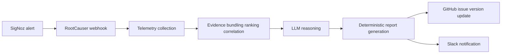
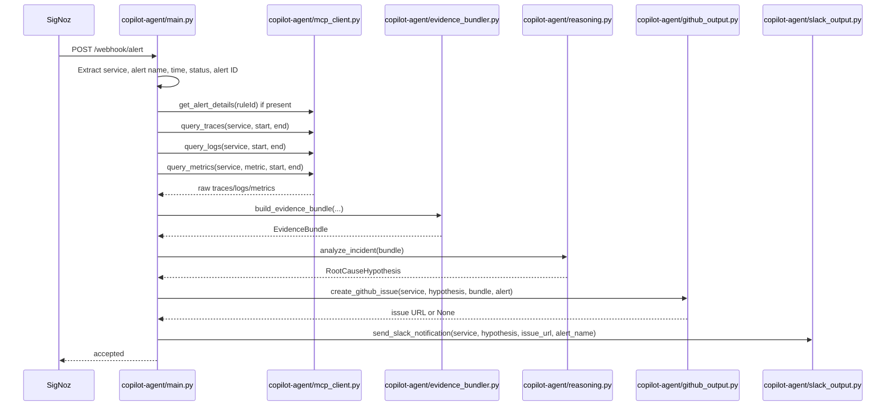
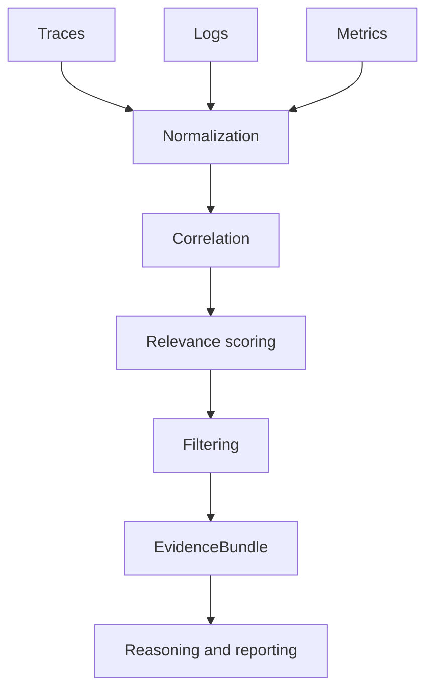
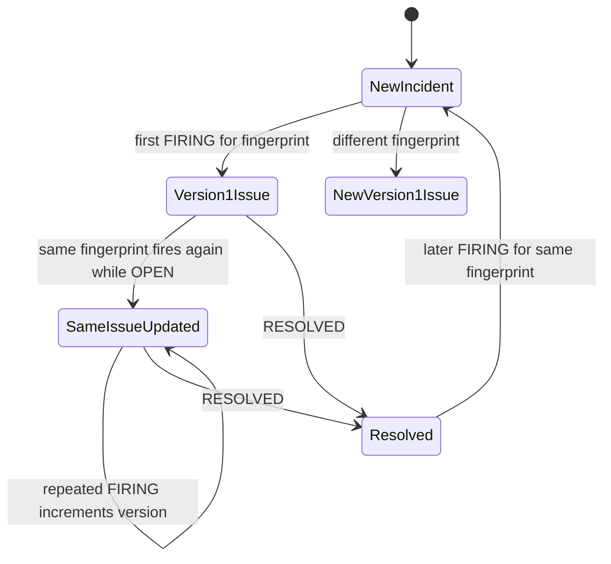

# RootCauser Interview Guide

## One-sentence description

RootCauser is a local-first incident-investigation prototype that turns SigNoz alerts into a deterministic evidence bundle, a citation-checked OpenRouter hypothesis, a GitHub incident report, and an optional Slack notification.

## Problem and motivation

Traditional alerting tells an engineer that a threshold fired but leaves them to correlate traces, logs, metrics, timing, and alert configuration manually. RootCauser automates that first investigation pass while keeping retrieval, ranking, reporting facts, and claim validation deterministic. It does not claim to discover every root cause; when evidence is incomplete, it explicitly reports insufficient evidence.

## Architecture and runtime flow

`demo-service` emits OpenTelemetry traces, logs, and metrics to `otel-collector`, which forwards them to SigNoz. SigNoz calls `POST /webhook/alert` in `copilot-agent/main.py`. `process_alert()` extracts service, incident time, alert name, and rule ID when present; resolves the SigNoz alert definition; builds a deterministic incident fingerprint from the service, alert name, and normalized labels; queries SigNoz evidence; calls `build_evidence_bundle()`; calls `analyze_incident()`; creates or updates a GitHub issue; and sends Slack after the issue operation.

The primary APIs are SigNoz `POST /api/v5/query_range` and `GET /api/v2/rules/{uuid}`. `mcp_client.py` uses authenticated REST with a single retry. The project keeps the historical MCP-facing name but does not use a live MCP endpoint.

What each block does and where it lives:

- `SigNoz alert`: the alert payload emitted by SigNoz and received by `POST /webhook/alert`.
- `RootCauser webhook`: `copilot-agent/main.py` receives the alert, validates the optional shared secret, extracts alert context, and orchestrates the run.
- `Telemetry collection`: `copilot-agent/mcp_client.py` calls SigNoz REST to fetch traces, logs, metrics, and alert-rule details.
- `Evidence bundling ranking correlation`: `copilot-agent/evidence_bundler.py` normalizes records, scores relevance, applies correlation signals, and builds `EvidenceBundle`.
- `LLM reasoning`: `copilot-agent/reasoning.py` calls OpenRouter and validates that cited IDs are literally present in the evidence bundle.
- `Deterministic report generation`: `copilot-agent/github_output.py` renders the report sections and current incident version from the selected evidence and validated hypothesis.
- `GitHub issue version update`: `copilot-agent/github_output.py` tracks the open incident fingerprint and updates or creates the GitHub issue as needed.
- `Slack notification`: `copilot-agent/slack_output.py` sends the summary only after the investigation result is available.

What it means:

- The webhook is accepted immediately, and the investigation runs in the background.
- The alert identity is looked up before issue creation so repeated firings can version the same incident.
- Evidence collection happens before LLM reasoning.
- The GitHub report and Slack message are produced only after the evidence bundle and validated hypothesis exist.

What each stage does:

- `Traces`, `Logs`, `Metrics`: raw SigNoz records from `mcp_client.py`.
- `Normalization`: `copilot-agent/evidence_bundler.py` unwraps nested `data` records and converts raw fields into `SpanEvidence`, `LogEvidence`, and `MetricSeries`.
- `Correlation`: span IDs and trace IDs are compared with each other and with logs to determine incident relevance.
- `Relevance scoring`: deterministic scores and reasons are assigned from service match, semantic match, correlation, alert-time proximity, severity/status, duration, and health penalties.
- `Filtering`: only supporting spans are selected; logs are ranked; metrics are preserved when the query returned usable series.
- `EvidenceBundle`: the final bounded structure passed to reasoning and report generation.
- `Reasoning and reporting`: `copilot-agent/reasoning.py` and `copilot-agent/github_output.py` turn the bundle into a grounded hypothesis and deterministic report.

What each state means:

- `NewIncident`: `copilot-agent/github_output.py` has no open record for that fingerprint.
- `Version1Issue`: the first GitHub issue is created with `Incident Version: 1`.
- `SameIssueUpdated`: repeated FIRING notifications for the same open fingerprint PATCH the same issue and increment the version.
- `Resolved`: `copilot-agent/main.py` marks the matching open fingerprint as resolved when the alert status is explicitly `RESOLVED`.
- `NewVersion1Issue`: a different fingerprint is treated as a different incident and creates a new issue.

Files that implement this flow:

- `copilot-agent/main.py`: extracts alert status, alert name, rule ID, service, and incident timing.
- `copilot-agent/github_output.py`: computes the fingerprint, stores process-local incident state, and creates or updates the issue.
- `copilot-agent/prompts/issue_template.md`: renders the version field in the report body.

## Telemetry and evidence

Traces identify operations with trace/span IDs, duration, status, and service. Logs contain body, severity, optional trace/span IDs, and timestamp. Metrics are builder-query aggregation series with timestamp/value points. The v5 metric parser follows `results[].aggregations[].series[].values[]` and bounds series and points. Log retrieval is optional: unsupported SigNoz JSON* query behavior returns an empty list rather than aborting trace/metric investigation.

`EvidenceBundle` in `evidence_bundler.py` contains `SpanEvidence`, `LogEvidence`, and `MetricSeries`. It preserves real IDs and values. There is no metric synthesis from span duration and no invented log or trace data.

## Deterministic ranking and reporting

Ranking happens before LLM reasoning. Signals are service match, alert/rule/composite-query semantics, log trace/span correlation, multiple spans in a trace, alert-time proximity, error/WARN status, secondary duration, health/readiness/liveness penalties, duplicate suppression, and a per-trace diversity limit. Selected spans and logs expose `relevance_score` and `relevance_reasons`.

`github_output.build_report_facts()` derives the Evidence Summary, Evidence Chain, Confidence Breakdown, Incident Timeline, Evidence Coverage, and Raw Evidence Bundle directly from selected evidence. It normalizes timestamps when possible and omits a timeline when it cannot interpret any timestamp. These are not LLM facts.

## LLM boundary and confidence

`reasoning.py` sends only the bounded bundle to OpenRouter's OpenAI-compatible chat-completions endpoint using `LLM_MODEL_NAME`. The LLM produces a concise hypothesis, literal evidence citations, and suggested fix. `parse_and_validate_hypothesis()` rejects citations absent from `bundle.searchable_text()`. Result states distinguish success, insufficient evidence, malformed/failed LLM output, and citation-validation failure. Confidence is High for validated span plus metric evidence, Medium for one, and Low otherwise. Timeout increases are framed as mitigations, not confirmed root fixes, when timeout evidence exists.

## GitHub, Slack, and incident versioning

`create_github_issue()` renders the deterministic facts plus validated hypothesis. The raw bundle remains an audit record. `slack_output.py` sends service, alert, confidence, summary, suggested fix, and issue link only when Slack and an issue URL are configured.

Versioning is intentionally lightweight. `_ACTIVE_INCIDENTS` is an in-memory map keyed by a deterministic incident fingerprint built from the service, alert name, and normalized labels. The first firing POSTs a GitHub issue with Incident Version 1. A repeated active firing PATCHes that same issue with Version 2, 3, and so on. `_extract_alert_status()` recognizes explicit FIRING/RESOLVED values; RESOLVED marks the matching open incident as resolved. A later firing then creates a new Version 1 issue.

This is deduplication within one agent process, not durable idempotency. Restarting the agent loses state. A webhook without a stable identity cannot be safely deduplicated. A deployment that does not send an explicit RESOLVED status cannot reliably delimit a firing lifecycle.

## Supported incident paths

`demo-service` supports a slow query (`/orders?inject_bug=slow_query`) and a downstream failure (`/orders?inject_bug=flaky_downstream`). The first yields slow query telemetry and query-duration metrics; the second yields error spans/logs and `downstream.errors` metric data when available. The pipeline is generic over evidence names; these examples are seeded workloads, not hardcoded conclusions.

## Local development and testing

Start with `docker compose up -d --build`. Health checks are `http://localhost:8000/health` and `http://localhost:8001/health`; SigNoz is `http://localhost:8080`. Generate a slow query with `Invoke-RestMethod "http://localhost:8000/orders?inject_bug=slow_query"`. Use the manual webhook procedure in `docs/SETUP_AND_TESTING.md` for receiver smoke testing, and a real firing for full SigNoz-to-GitHub/Slack validation.

Run `venv\Scripts\python.exe -m pytest -q`. Tests cover normalization, ranking, citation validation, UUID extraction, metric shapes, report facts, timeout remediation framing, and in-memory incident versioning. Unit tests mock external services.

## Important files

- `copilot-agent/main.py`: webhook parsing and orchestration.
- `copilot-agent/mcp_client.py`: SigNoz REST queries and normalization.
- `copilot-agent/evidence_bundler.py`: Pydantic evidence and deterministic ranking.
- `copilot-agent/reasoning.py`: OpenRouter request and citation validation.
- `copilot-agent/github_output.py`: report facts, GitHub create/update, active version map.
- `copilot-agent/slack_output.py`: Slack output.
- `tests/`: offline regression coverage.

## Design decisions and tradeoffs

The central decision is deterministic evidence selection before LLM reasoning. It makes the model input inspectable, prevents raw telemetry retrieval from becoming an LLM task, and allows independent tests. REST was retained because the local SigNoz deployment exposes the verified v5/v2 HTTP APIs. In-memory versioning was chosen over a database to keep v1 local and small; the tradeoff is loss of state on restart. GitHub PATCH is used for repeated incidents rather than opening duplicate issues.

## Debugging playbook

Start with agent logs: verify service, alert ID/name, time window, raw/relevant trace counts, logs, metric points, LLM status, and issue URL. In SigNoz, verify telemetry exists in the same window and service filter. If logs are empty, check the documented JSON* limitation; traces and metrics should still continue. If metrics are empty, inspect the v5 aggregation response and requested metric name. If an issue is new instead of updated, check for a stable incident fingerprint, process restart, and RESOLVED status. If reasoning is insufficient, inspect the raw evidence section and cited IDs rather than assuming a model defect.

## Security and configuration

Credentials come from environment-backed settings: SigNoz API key, `LLM_API_KEY`, GitHub token/repo, optional Slack webhook, and optional `WEBHOOK_SHARED_SECRET`. They must not be committed or logged. TLS verification is not disabled. The webhook secret protects the receiver when configured.

## Explicitly not implemented

No database, persistent incident store, queue, worker, dashboard, multi-alert correlation, cross-service topology, autonomous remediation, GitHub deduplication across restarts, or production-grade authorization workflow is implemented.

## Interview questions and concise answers

**Why not let the LLM inspect SigNoz directly?** Deterministic retrieval and ranking are cheaper, repeatable, auditable, and testable; the model is constrained to synthesis.

**How do you prevent hallucinated root causes?** The prompt requires grounding, citations are literal-checked against the bundle, and uncertainty returns insufficient evidence.

**How do traces, logs, and metrics correlate?** Trace/span IDs connect logs to selected operations; timestamps position events; metrics show aggregate behavior over the same window.

**Why is duration secondary?** The longest span may be unrelated routine work. Correlation and alert semantics provide stronger incident relevance.

**What happens if SigNoz logs fail?** The client logs the failure and returns `[]`; the rest of the investigation continues with traces and metrics.

**What makes issue versioning safe?** It is safe only within one process and only with a stable incident fingerprint. The guide explicitly calls out restart and missing-status limitations rather than claiming durable idempotency.

**What would you change for production?** Add durable incident state and explicit alert lifecycle guarantees, but those are intentionally outside this v1 implementation.
